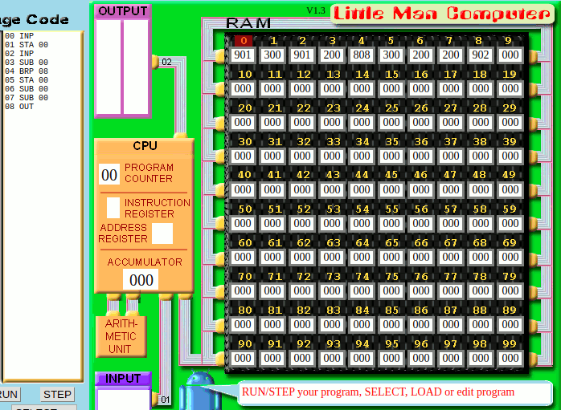

# LMC work from home

← [Back to Week 3](./index.html)

## Simple challenges

### S1

> Write a program that enters 3 numbers such as 5, 8, 3 and then outputs them in reverse as in 3, 8, 5.

```lmc
        INP
        STA 0
        INP
        STA 1
        INP
        OUT
        LDA 1
        OUT
        LDA 0
        OUT
```


### S2

> Write a program that asks for two numbers. It then outputs the first number subtracting the second number and then outputs the second number subtracting the first number. Eg if 3 and 5 were entered the first sum would be 3-5 and the second sum would be 5-3.

```lmc
        INP
        STA 0
        INP
        STA 1
        SUB 0
        STA 2
        LDA 0
        SUB 1
        OUT
        LDA 2
        OUT
```


### S3

> Write a program that outputs the negative of a positive number. So if 7 is entered -7 is output.

```lmc
        INP
        STA 0
        SUB 0
        SUB 0
        OUT
```


## Intermediate challenges

### I1

> Ask the user for 2 numbers. If they are the same then double the number and print it out. If they are different then print them both out individually.

```lmc
        INP
        STA 0
        INP
        STA 1
        SUB 0
        BRZ double
        LDA 0
        OUT
        LDA 1
        OUT
        HLT
double  ADD 0
        ADD 0
        OUT
```


### I2

> Ask the user for 2 numbers. Print out biggest, then the smallest.

```lmc
        INP
        STA 0
        INP
        SUB 0
        BRP bigger
        ADD 0
        STA 1
        LDA 0
        OUT
        LDA 1
        OUT
        HLT
bigger  ADD 0
        OUT
        LDA 0
        OUT
```


### I3

> Ask the user for 2 numbers, print out the result of the biggest number minus the smallest number.

```lmc
        INP
        STA 0
        INP
        SUB 0
        BRP out_
        STA 0
        SUB 0
        SUB 0
out_    OUT
```

