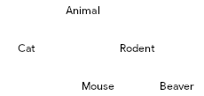

# 1.2.4 - Object Oriented Programming Redo

1. What attributes might be assigned to the following objects of the following classes?
   1. `Cat`
      - `hunger`
      - `affection`
      - `name`
      - `age`
      - `fur_colour`
      - `eye_colour`
   2. `Rectangle`
      - `x1`
      - `y1`
      - `x2`
      - `y2`
   3. `HotelBooking`
      - `occupant`
      - `start`
      - `end`
      - `room`
      - `rate`
2. In the class definition for `Radio` (shown below) add the missing instance variables, and a procedure to set the volume.

   ```
   class Radio
       private volume
       private station
       private switch

       public procedure new(my_volume, my_station, my_switch)
           volume = my_volume
           station = my_station
           switch = my_switch
       endprocedure

       public procedure set_volume(new_volume)
           volume = new_volume
       endprocedure
   endclass
   ```
3. Write pseudocode statements to instantiate two new radio objects named `roberts_radio` and `philips_radio`.

   ```
   roberts_radio = new Radio(31.4, '88MHz', 'on')
   philips_radio = new Radio(27.2, '42MHz', 'off')
   ```
4. [](./inheritance_diagram.png)  
   *Class diagram involving inheritance*

   All the animals in the superclass `Animal` share common attributes such as `name` and `position`. Animals may also have common procedures (methods), such as `move_left`, `move_right`. A `Cat` may have an extra attribute `size`, and an extra method `pounce`. A `Rodent` may have an extra method `gnaw`. A `Beaver` may have an extra method, `make_dam`.

   What extra methods might `Mouse` have?
   - `squeak`
   - `scamper`
5. The class `Animal` may be defined like this:

   ```
   class Animal
       private name
       private position

       public procedure new(my_name, my_position)
           name = my_name
           position = my_position
       endprocedure

       public procedure move_left(steps)
           position = position = steps
       endprocedure

       public function get_position()
           return position
       endfunction
   endclass
   ```

   `Cat` is a subclass of `Animal` (and has an extra attribute - size); here is its class definition:

   ```
   class Cat inherits Animal
       private size

       public procedure new(my_name, my_position, my_size)
           super.new(my_name, my_position)
           size = my_size
       endprocedure

       public procedure move_left(steps)
           position = position - (steps * 3)
       endprocedure
   endclass
   ```

   A rodent has an extra attribute `colour`.  
   Write the class definition for `Rodent`

   ```
   class Rodent inherits Animal
       private colour

       public procedure new(my_name, my_position, my_colour)
           super.new(my_name, my_position)
           colour = my_colour
       endprocedure
   endclass
   ```
6. All objects in the subclasses of `Animal` can execute the methods `move_left` and `move_right`, causing the animal to move left or right by one space.

   But the subclasses may decide that a `Cat` can move three spaces with a `move_left` or `move_right` message, and a `Rodent` moves two spaces. You would define different methods in each of the classes to implement these moves, but keeping the same method name. This would override the method in the superclass.

   Suppose that `tom` is an instance of the `Cat` class, and `jerry` is an instance of the `Mouse` class. What will happen when each of these statements is executed?
   1. `tom.move_right()`
      - `tom`'s `position` will increase by 3
   2. `jerry.move_right()`
      - `jerry`'s `position` will increase by 2

## Exercises

1. A sports club keeps details of its members. Each member has a unique membership number, first name, surname, and telephone number recorded. Three classes have been identified:
   - `Member`
   - `JuniorMember`
   - `SeniorMember`

   The classes `JuniorMember` and `SeniorMember` are related, by single inheritance, to the class `Member`.

   1. Draw an inheritance diagram for the given classes.

      ```
                Member
                 ╱  ╲
      JuniorMember  SeniorMember
      ```
   2. Programs that use objects of the class `Member` need to create a new member, edit a member's details, delete a member's details, and show a member's details. No other form of access is to be allowed.

      Complete the definition of the attributes and the procedure new for the `Member` class.

      ```
      class Member
          private number
          public forename
          public surname
          public tel

          public procedure new(my_number, my_forename, my_surname, my_tel)
              number = my_number
              forename = my_forename
              surname = my_surname
              tel = my_tel
          endprocedure
      endclass
      ```
   3. In object-oriented programming, what is meant by encapsulation?
      - Encapsulation is where an object's state is protected, and all access and modifications are performed through the class' getters and setters, which can perform validation on the values assigned or calculation on the values retrieved
