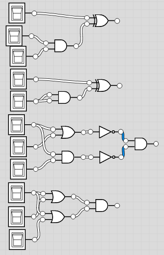

# Logic Gates

Gate | Symbol | Operator
--- | --- | ---
Conjuction AND |  | ∧
Disjunction OR |  | ∨
Negation NOT |  | ¬
Exclusive Disjunction XOR |  | ⊻

Q = ¬A ∨ (B ∧ C)

Input A | Input B | Input C | D = ¬A | E = B ∧ C | Output Q = D ∨ E
:---: | :---: | :---: | :---: | :---: | :---:
0 | 0 | 0 | 1 | 0 | 1
1 | 0 | 0 | 0 | 0 | 0
0 | 1 | 0 | 1 | 0 | 1
1 | 1 | 0 | 0 | 0 | 0
0 | 0 | 1 | 1 | 0 | 1
1 | 0 | 1 | 0 | 0 | 0
0 | 1 | 1 | 1 | 1 | 1
1 | 1 | 1 | 0 | 1 | 1

## Logic Circuits

- Made up of a series of logic gates to create full systems
  - Could be thousands of gates
- The output from the first gate becomes the input for the second gate and so on

e.g. Simple alarm system

A or B = 1 means that the sensors have picked up an intruder
A or B = 0 means that the sensors have not picked up an intruder
C = 1 means the override button has been pressed to turn the alarm off
C = 0 means the alarm will continue to sound

Q = (A ∨ B) ∧ ¬C

  A |   B |   C |   Q
:-: | :-: | :-: | :-:
  0 |   0 |   0 |   0
  1 |   0 |   0 |   1
  0 |   1 |   0 |   1
  1 |   1 |   0 |   1
  0 |   0 |   1 |   0
  1 |   0 |   1 |   0
  0 |   1 |   1 |   0
  1 |   1 |   1 |   0

Q = (A ∧ B) ∧ (C ∨ D)

Q = (¬A ∨ (A ∧ B)) ∨ C

Q = ¬((A∧B) ∨ ¬(A∧C))

 A | B | C | Q
:-:|:-:|:-:|:-:
 0 | 0 | 0 | 0
 1 | 0 | 0 | 0
 0 | 1 | 0 | 0
 1 | 1 | 0 | 0
 0 | 0 | 1 | 0
 1 | 0 | 1 | 1
 0 | 1 | 1 | 0
 1 | 1 | 1 | 0
