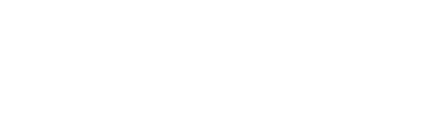

# Garden planner

1. A program is needed to plan the layout of a garden.

    The program will allow the user to create an image of the garden, for example:

    

    1. The programmer will use abstraction to produce the program interface to represent the garden.
        1. Give **two** different examples of how abstraction has been used to produce the layout of the garden.
            1. All objects have been reduced to simple shapes; ellipses for the trees and rectangles for all others.
            2. Objects are considered in 2D rather than 3D; the layout is top-down with no consideration of height/depth.
        2. Abstraction reduces the programming complexity as fewer dimensions must be considered when computing for collisions, and determining collisions of simple 2D shapes is much easier than determining collisions of arbitrary complex 2D shapes. It also reduces the computational effort meaning that a lower-spec device can be used to run the program.
