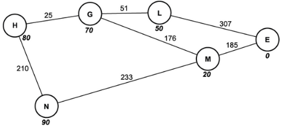

# Optimisation algorithms

## A*

The A* algorithm uses a heuristic: h = 5(nodes to target)

Add the heuristic value to the sum of the node weights, perform BFS using a priority queue as in Dijkstra's algorithm

## Exam style questions

1. &#x200b;

   1. Fig. 2.1 shows the flight paths between a country's airports. The value in bold beneath each node is the heuristic value from E.

        
      Fig. 2.1

      State the full name of the data structure shown in Fig. 2.1.
      - Weighted ~~bidirectional~~ undirected graph
   2. The structure in Fig. 2.1 is searched using the A* algorithm making use of the heuristic values.
      1. State what the heuristic values could represent in Fig. 2.1
         - Physical distance from E to the node
      2. State the purpose of heuristic values in the A* algorithm.
         - Using heuristic values for each node allows the algorithm to spend less time searching paths which are unlikely to be the shortest
      3. Perform an A* algorithm on the data structure in Fig. 2.1 to find the shortest distance between H and E. Show each step of the process, and the calculations performed for each node visited.
         - 

Step 0

           | Visited | Queued         | Unknown |
           | ------- | -------------- | ------- |
           |         | H - 0 + 80 - 0 |         |
           |         |                | G       |
           |         |                | N       |
           |         |                | L       |
           |         |                | M       |
           |         |                | E       |
         

         - 

Step 1

           | Visited    | Queued                       | Unknown |
           | ---------- | ---------------------------- | ------- |
           | H - 80 - 0 |                              |         |
           |            | H⇒G - 0 + 25 + 70 - 0 + 25   |         |
           |            | H⇒N - 0 + 210 + 90 - 0 + 210 |         |
           |            |                              | L       |
           |            |                              | M       |
           |            |                              | E       |
         

         - 

Step 2

           | Visited       | Queued                         | Unknown |
           | ------------- | ------------------------------ | ------- |
           | H - 0 - 0     |                                |         |
           | H⇒G - 95 - 25 |                                |         |
           |               | H⇒N - 300 - 210                |         |
           |               | G⇒L - 25 + 51 + 50 - 25 + 51   |         |
           |               | G⇒M - 25 + 176 + 20 - 25 + 176 |         |
           |               |                                | E       |
         

         - 

Step 3

           | Visited        | Queued                        | Unknown |
           | -------------- | ----------------------------- | ------- |
           | H - 0 - 0      |                               |         |
           | H⇒G - 95 - 25  |                               |         |
           | G⇒L - 126 - 76 |                               |         |
           |                | G⇒M - 221 - 201               |         |
           |                | H⇒N - 300 - 210               |         |
           |                | L⇒E - 76 + 307 + 0 - 76 + 307 |         |
         

         - 

Step 4

           | Visited         | Queued                                             | Unknown |
           | --------------- | -------------------------------------------------- | ------- |
           | H - 0 - 0       |                                                    |         |
           | H⇒G - 95 - 25   |                                                    |         |
           | G⇒L - 126 - 76  |                                                    |         |
           | G⇒M - 221 - 201 |                                                    |         |
           |                 | H⇒N - 300 - 210                                    |         |
           |                 | L⇒E - 383 - 383 \| M⇒E - 201 + 185 + 0 - 201 + 185 |         |
         

         - 

Step 5

           | Visited         | Queued                                 | Unknown |
           | --------------- | -------------------------------------- | ------- |
           | H - 0 - 0       |                                        |         |
           | H⇒G - 95 - 25   |                                        |         |
           | G⇒L - 126 - 76  |                                        |         |
           | G⇒M - 221 - 201 |                                        |         |
           | H⇒N - 300 - 210 |                                        |         |
           |                 | L⇒E - 383 - 383 ~~\| M⇒E - 386 - 386~~ |         |
         

         - 

Step 6

           | Visited             | Queued | Unknown |
           | ------------------- | ------ | ------- |
           | H - 0 - 0           |        |         |
           | H⇒G - 95 - 25       |        |         |
           | G⇒L - 126 - 76      |        |         |
           | ~~G⇒M - 221 - 201~~ |        |         |
           | ~~H⇒N - 300 - 210~~ |        |         |
           | L⇒E - 383 - 383     |        |         |
         

         - Fastest route: H⇒G⇒L⇒E
