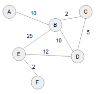
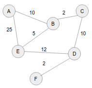
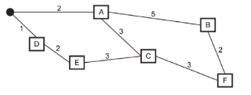
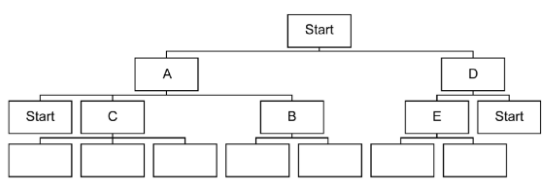

# Optimisation algorithms

## Dijkstra & co.

## Activity: Traversal reminder

Find the order in which the following nodes are visited in Depth-First Traversal and Breadth-First Traversal

[](./dijkstra_graph_1.png)

DFS: A⇒B⇒C⇒D⇒E⇒F  
BFS: A⇒B⇒C, (B)⇒D, (B)⇒E⇒F

## Traversal vs optimisation

- Traversal: 'Can I get from A to F?'
- Optimisation: 'What is the shortest route from A to F?'
  - Validity: 'Am I guaranteed to find the shortest route?'
  - Efficiency: 'Can I short-circuit useless searches?'

## Algorithm optimisations

| Algorithm                                   | DFS              | BFS                                  | Dijkstra | A*  |
| ------------------------------------------- | ---------------- | ------------------------------------ | -------- | --- |
| Guaranteed to find any path                 | yes              | yes                                  |          |     |
| Guaranteed to find *shortest* path          | no               | yes (when nodes have uniform weight) |          |     |
| Efficiently short-circuits irrelevant paths | yes (on average) | no                                   |          |     |

## dijkstra's algorithm: Enhanced BFS

- DFS: Nodes added to **stack**
- BFS: Nodes added to **queue**
- dijkstra's algorithm: Nodes added to **priority queue**
  - Priority to closest node - nodes are ordered using distance from start point

[](./dijkstra_graph_1.png)

- <details><summary>Step 0</summary>

  | Visited | Queue | Unknown nodes |
  | ------- | ----- | ------------- |
  |         | A - 0 |               |
  |         |       | B - inf       |
  |         |       | C - inf       |
  |         |       | D - inf       |
  |         |       | E - inf       |
  |         |       | F - inf       |

</details>

- <details><summary>Step 1</summary>

  | Visited | Queue    | Unknown nodes |
  | ------- | -------- | ------------- |
  | A - 0   |          |               |
  |         | A⇒B - 10 |               |
  |         |          | C - inf       |
  |         |          | D - inf       |
  |         |          | E - inf       |
  |         |          | F - inf       |

</details>

- <details><summary>Step 2</summary>

  | Visited  | Queue    | Unknown nodes |
  | -------- | -------- | ------------- |
  | A - 0    |          |               |
  | A⇒B - 10 |          |               |
  |          | B⇒C - 12 |               |
  |          | B⇒D - 20 |               |
  |          | B⇒E - 35 |               |
  |          |          | F - inf       |

</details>

- <details><summary>Step 3</summary>

  | Visited  | Queue        | Unknown nodes |
  | -------- | ------------ | ------------- |
  | A - 0    |              |               |
  | A⇒B - 10 |              |               |
  | B⇒C - 12 |              |               |
  |          | C⇒D - 17     |               |
  |          | ~~B⇒D - 20~~ |               |
  |          | B⇒E - 35     |               |
  |          |              | F - inf       |

</details>

- <details><summary>Step 4</summary>

  | Visited  | Queue        | Unknown nodes |
  | -------- | ------------ | ------------- |
  | A - 0    |              |               |
  | A⇒B - 10 |              |               |
  | B⇒C - 12 |              |               |
  | C⇒D - 17 |              |               |
  |          | D⇒E - 29     |               |
  |          | ~~B⇒E - 35~~ |               |
  |          |              | F - inf       |

</details>

- <details><summary>Step 5</summary>

  | Visited  | Queue    | Unknown nodes |
  | -------- | -------- | ------------- |
  | A - 0    |          |               |
  | A⇒B - 10 |          |               |
  | B⇒C - 12 |          |               |
  | C⇒D - 17 |          |               |
  | D⇒E - 29 |          |               |
  |          | E⇒F - 31 |               |

</details>

- <details><summary>Step 6</summary>

  | Visited      | Queue | Unknown nodes |
  | ------------ | ----- | ------------- |
  | **A - 0**    |       |               |
  | **A⇒B - 10** |       |               |
  | **B⇒C - 12** |       |               |
  | **C⇒D - 17** |       |               |
  | **D⇒E - 29** |       |               |
  | **E⇒F - 31** |       |               |

</details>

## Activity: user Dijkstra's algorithm to find the best route from A to F

[](./dijkstra_graph_2.png)

- <details><summary>Step 0</summary>

  | Visited | Queue | Unknown nodes |
  | ------- | ----- | ------------- |
  |         | A - 0 |               |
  |         |       | B - inf       |
  |         |       | C - inf       |
  |         |       | D - inf       |
  |         |       | E - inf       |
  |         |       | F - inf       |

</details>

- <details><summary>Step 1</summary>

  | Visited | Queue    | Unknown nodes |
  | ------- | -------- | ------------- |
  | A - 0   |          |               |
  |         | A⇒B - 10 |               |
  |         | A⇒E - 25 |               |
  |         |          | C - inf       |
  |         |          | D - inf       |
  |         |          | F - inf       |

</details>

- <details><summary>Step 2</summary>

  | Visited  | Queue        | Unknown nodes |
  | -------- | ------------ | ------------- |
  | A - 0    |              |               |
  | A⇒B - 10 |              |               |
  |          | B⇒C - 12     |               |
  |          | B⇒E - 15     |               |
  |          | ~~A⇒E - 25~~ |               |
  |          |              | D - inf       |
  |          |              | F - inf       |

</details>

- <details><summary>Step 3</summary>

  | Visited  | Queue    | Unknown nodes |
  | -------- | -------- | ------------- |
  | A - 0    |          |               |
  | A⇒B - 10 |          |               |
  | B⇒C - 12 |          |               |
  |          | B⇒E - 15 |               |
  |          | C⇒D - 22 |               |
  |          |          | F - inf       |

</details>

- <details><summary>Step 4</summary>

  | Visited  | Queue        | Unknown nodes |
  | -------- | ------------ | ------------- |
  | A - 0    |              |               |
  | A⇒B - 10 |              |               |
  | B⇒C - 12 |              |               |
  | B⇒E - 15 |              |               |
  |          | C⇒D - 22     |               |
  |          | ~~E⇒D - 27~~ |               |
  |          |              | F - inf       |

</details>

- <details><summary>Step 5</summary>

  | Visited  | Queue    | Unknown nodes |
  | -------- | -------- | ------------- |
  | A - 0    |          |               |
  | A⇒B - 10 |          |               |
  | B⇒C - 12 |          |               |
  | B⇒E - 15 |          |               |
  | C⇒D - 22 |          |               |
  |          | D⇒F - 24 |               |

</details>

- <details><summary>Step 6</summary>

  | Visited      | Queue | Unknown nodes |
  | ------------ | ----- | ------------- |
  | **A - 0**    |       |               |
  | **A⇒B - 10** |       |               |
  | **B⇒C - 12** |       |               |
  | B⇒E - 15     |       |               |
  | **C⇒D - 22** |       |               |
  | **D⇒F - 24** |       |

</details>

| Algorithm                                   | DFS              | BFS                                  | Dijkstra | A*  |
| ------------------------------------------- | ---------------- | ------------------------------------ | -------- | --- |
| Guaranteed to find any path                 | yes              | yes                                  | yes      |     |
| Guaranteed to find *shortest* path          | no               | yes (when nodes have uniform weight) | yes      |     |
| Efficiently short-circuits irrelevant paths | yes (on average) | no                                   | yes      |     |

## Exercises

1. &#x200b;
   1. A salesman travels around the country, stopping at specific places, then returning to the starting place.

      Fig. 6.1 shows an example map of places that the salesman visits.

      [](./dijkstra_graph_3.png)  
      Fig. 6.1

      The filled-in circle represents the start and end point. The boxed letters represent the places to visit. The lines are the routs available and the numbers are the length of time each route takes to travel.
   2. The travelling salesman aims to find the shortest route between these places to visit.

      A programmer is writing an algorithm to solve the travelling salesman problem.

      The programmer is using a tree to find the most efficient route. Fig. 6.2 shows part of the tree with three levels completed.

      [](./dijkstra_graph_4.png)  
      Fig. 6.2

      1. The 'start' nodes on level three are not expanded again as this is a repeat; 'start' has already been expanded.

         Write the place names for the boxes in Fig. 6.2 to complete the fourth level of the tree structure for the map shown in Fig. 6.1

         C⇒{A, E, F}, B⇒{A, F}, E⇒{D, C}

      2. Explain why the tree in Fig. 6.2 is not a binary tree

         It is not a binary tree as there are more than two child nodes for most nodes

   3. The programmer has decided to use a graph instead of a tree structure.

      1. Describe what is meant by a graph structure.

         A graph structure is a group of nodes that are connected to each other, with each connection having a weight that represent the cost of travel between its endpoints

      2. The pseudocode below shows part of an algorithm, which uses a queue to traverse the graph breadth-first.  
         Complete the missing elements of the algorithm.

         ```
         markAllVertices(notVisited)
         createQueue()
         start = notVisited[0]
         markAsVisited(start)
         pushIntoQueue(start)
         while QueueIsEmpty() == false
             currentNode = removeFromQueue()
             while allNodesVisited() == false
                 markAsVisited(currentNode)
                 // following sub-routine pushes all nodes connected to
                 // currentNode AND that are unvisited
                 pushUnvisitedAdjacents()
             endwhile
         endwhile
         ```
   4. Fig. 6.3 is a graph representation of the places that the travelling salesman visits. Using this graph, show how Dijkstra's algorithm would find the shortest path from place A to place F

      [](./dijkstra_graph_5.png)  
      Fig. 6.3

      - <details><summary>Step 0</summary>

        | Visited | Queue | Unknown |
        | ------- | ----- | ------- |
        |         | A - 0 |         |
        |         |       | B - inf |
        |         |       | C - inf |
        |         |       | D - inf |
        |         |       | E - inf |
        |         |       | F - inf |

      </details>

      - <details><summary>Step 1</summary>

        | Visited | Queue   | Unknown |
        | ------- | ------- | ------- |
        | A - 0   |         |         |
        |         | A⇒C - 3 |         |
        |         | A⇒D - 3 |         |
        |         | A⇒B - 5 |         |
        |         |         | E - inf |
        |         |         | F - inf |

      </details>

      - <details><summary>Step 2</summary>

        | Visited | Queue   | Unknown |
        | ------- | ------- | ------- |
        | A - 0   |         |         |
        | A⇒C - 3 |         |         |
        |         | A⇒D - 3 |         |
        |         | A⇒B - 5 |         |
        |         | C⇒E - 6 |         |
        |         | C⇒F - 6 |         |

      </details>

      - <details><summary>Step 3</summary>

        | Visited | Queue       | Unknown |
        | ------- | ----------- | ------- |
        | A - 0   |             |         |
        | A⇒C - 3 |             |         |
        | A⇒D - 3 |             |         |
        |         | A⇒B - 5     |         |
        |         | D⇒E - 5     |         |
        |         | ~~C⇒E - 6~~ |         |
        |         | C⇒F - 6     |         |

      </details>

      - <details><summary>Step 4</summary>

        | Visited | Queue       | Unknown |
        | ------- | ----------- | ------- |
        | A - 0   |             |         |
        | A⇒C - 3 |             |         |
        | A⇒D - 3 |             |         |
        | A⇒B - 5 |             |         |
        |         | D⇒E - 5     |         |
        |         | C⇒F - 6     |         |
        |         | ~~B⇒F - 7~~ |         |

      </details>

      - <details><summary>Step 5</summary>

        | Visited | Queue   | Unknown |
        | ------- | ------- | ------- |
        | A - 0   |         |         |
        | A⇒C - 3 |         |         |
        | A⇒D - 3 |         |         |
        | A⇒B - 5 |         |         |
        | D⇒E - 5 |         |         |
        |         | C⇒F - 6 |         |

      </details>

      - <details><summary>Step 6</summary>

        | Visited     | Queue | Unknown |
        | ----------- | ----- | ------- |
        | **A - 0**   |       |         |
        | **A⇒C - 3** |       |         |
        | A⇒D - 3     |       |         |
        | A⇒B - 5     |       |         |
        | D⇒E - 5     |       |         |
        | **C⇒F - 6** |       |         |

      </details>

       - Shortest route is A⇒C⇒F
