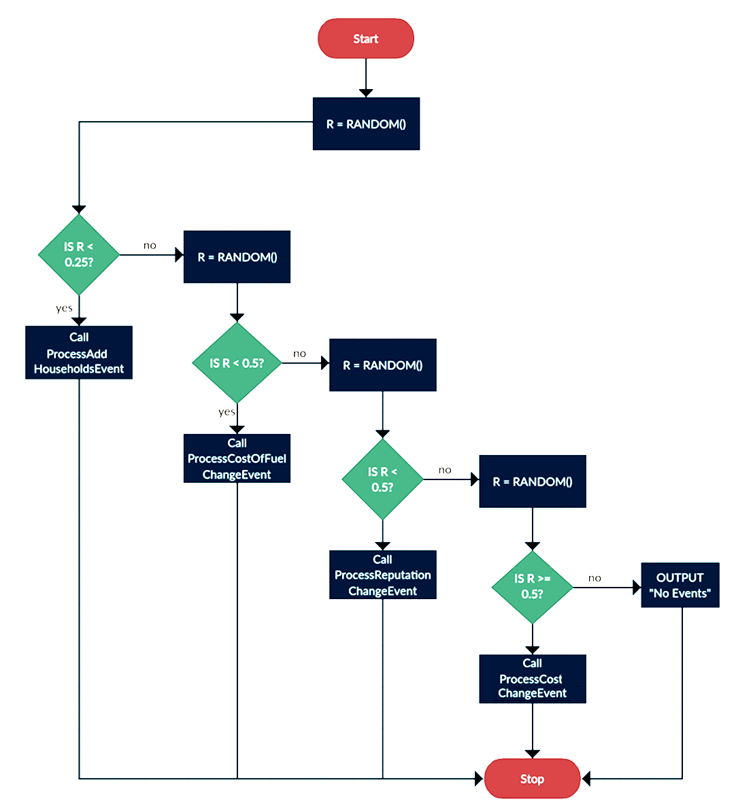

# Food Magnate Simulation Programming Tasks

*for the sake of my sanity I choose to complete these tasks in [the more pythonic version I created](./pythonic_food_magnate_simulation.py)*

## Task 1

This question refers to the subroutine `modify_company` within the `Simulation` class.

Currently, the user is prompted to enter a value of 1, 2 or 3, but if nothing is entered by the user, the program responds by outputting a blank line.

Change the subroutine `modify_company` to present the user with an additional choice: "C. Cancel". If the user enters anything other than 1, 2, 3 or an upper-case 'C', the menu should be redisplayed repeatedly until either 1, 2, 3 or C is selected. If 1, 2 or 3 is entered, `modify_company` should behave as normal. If an upper-case 'C' is entered, the program should output 'Operation Cancelled', and `modify_company` should return without executing any additional code.

Test that the changes you have made work:

- run the Food Magnate Sim program
- leave the first prompt blank, to indicate a normal-sized settlement
- enter `D` at the next prompt for default companies
- enter `3` for 'modify company'
- enter `AQA Burgers` when prompted for a company name
- enter `X` at the first prompt of the 'modify company' submenu
- enter `C` at the second prompt of the 'modify company' submenu

Click [here](./task_1.diff) to view the changes, [here](./pythonic_food_magnate_simulation_task_1.py) to view the full source file, or [here](https://asciinema.org/a/GScNovuXm5mVAWNgHZRTx9Hk5) to view the demonstration of the working changes (the source cast file is [here](./task_1.cast), and can be viewed using the `asciinema` command-line tool)

## Task 2

This question refers to the subroutine `get_random_location` within the `Settlement` class.

This subroutine generates a random location within the bounds of the settlement that is used to position a new household. Currently, there is no mechanism for ensuring that a new household is not assigned the location of an existing household.

Change the subroutine `get_random_location` to ensure that only unoccupied locations are returned. Prior to returning the location, a check should be made to determine whether the location is already occupied by a household. If it is already occupied, a new location should be generated, repeatedly if necessary.

Test that the changes you have made work:

- modify the `Settlement` constructor in the following ways:
- change `_x_size = 1000` to `_x_size = 3`
- change `_y_size = 1000` to `_y_size = 3`
- change `_initial_households = 250` to `_initial_households = 8`
- run the Food Magnate Sim program
- leave the first prompt blank, to indicate a normal-sized settlement
- enter `D` at the next prompt for default companies
- enter `1` for 'display details of households'

Click [here](./task_2.diff) to view the changes, [here](./pythonic_food_magnate_simulation_task_2.py) to view the full source file, or [here](https://asciinema.org/a/rcu9oyb6Qg58vQTiMmpbIdhue) to view the demonstration of the working changes (the source cast file is [here](./task_2.cast), and can be viewed using the `asciinema` command-line tool)

## Task 3

This question refers to the subroutine `_display_events_at_day_end` within the `Simulation` class.
Currently, there is a 25% chance of an event occurring when an end of day is run (which calls the `_display_events_at_day_end` subroutine). Modify the subroutine so that the following logic applies instead:
NB The function `RANDOM()` returns a real number from 0 to 1.

Test that the changes you have made work:

- run the Food Magnate Sim program
- leave the first prompt blank, to indicate a normal-sized settlement
- enter `D` at the next prompt for default companies
- enter `6` for 'advance to next day'
- repeat until each of the events (including no events) have been triggered

Click [here](./task_3.diff) to view the changes, [here](./pythonic_food_magnate_simulation_task_3.py) to view the full source file, or [here](https://asciinema.org/a/L1NIRev1K23g6FkT8wClAeBoo) to view the demonstration of the working changes (the source cast file is [here](./task_3.cast), and can be viewed using the `asciinema` command-line tool)
